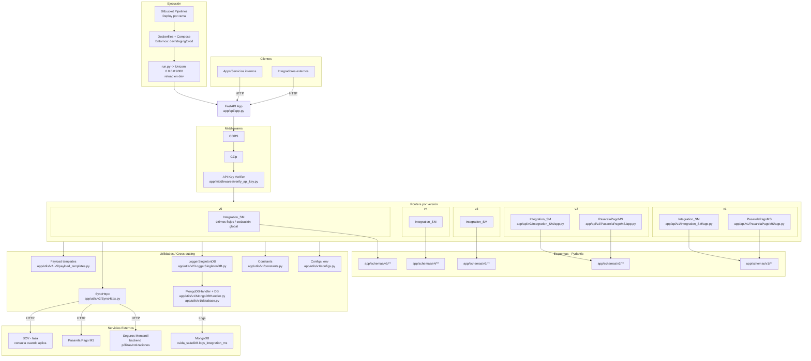

### Arquitectura — Integration Seguros Mercantil

Este documento describe la arquitectura a alto nivel del proyecto y provee un diagrama en formato Mermaid. Abra este archivo en un visor compatible con Mermaid (por ejemplo, GitHub, VS Code con la extensión adecuada, o el panel de vista previa de su IDE).

#### Visión general
- Framework: FastAPI (aplicación principal en `app/api/app.py`).
- Versionado de API: v1–v5 para `Integration_SM` y v1–v2 para `PasarelaPagoMS`.
- Esquemas: Pydantic en `app/schemas/**`.
- Utilidades transversales: configuración, constantes, logging (stdout/archivo/MongoDB), HTTP helper, plantillas de payload.
- Middlewares: CORS y GZip; verificación de API key como dependencia.
- Integraciones externas: Seguros Mercantil (productos/pólizas), Pasarela Pago MS, tasa BCV (cuando aplica), MongoDB para logs.

#### Diagrama (Mermaid)

#### Notas de diseño
- Las rutas consumen esquemas Pydantic por versión, evitando romper compatibilidad entre iteraciones.
- La configuración se centraliza con `BaseSettings` (carga por `.env`) y se expone como constantes de uso directo.
- El logging utiliza Loguru con sinks a stdout, archivo (rotación/retención) y MongoDB mediante un handler dedicado.
- `SyncHttpx` provee un helper sincrónico para llamadas HTTP salientes a los servicios externos.
- Las plantillas/mapeadores de payload permiten construir requests acordes a cada versión/endpoint externo.
- Los middlewares aplican CORS/GZip; la verificación de API Key se inyecta como dependencia a nivel de router/endpoint.

#### Cómo ejecutar
- Local: `python run.py` (puerto 9000; reload en desarrollo).
- Docker: `docker compose up --build` (usar archivos específicos por entorno).
