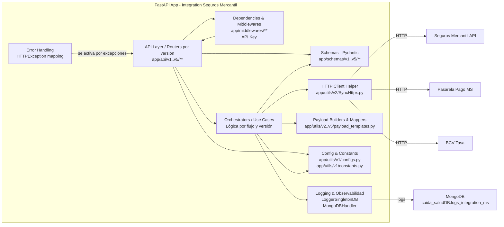
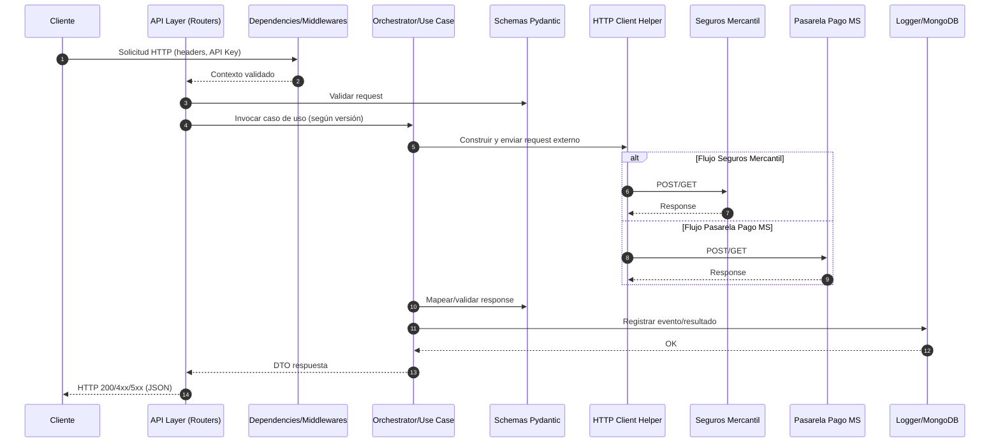

### Modelo C4-3 — Vista de Componentes (Integration Seguros Mercantil)

Este documento describe la vista de componentes (nivel C4-3) del servicio Integration Seguros Mercantil, implementado con FastAPI. El objetivo es mostrar cómo se estructura el contenedor de la aplicación en componentes principales, sus responsabilidades, interfaces y dependencias. Los diagramas se presentan en formato Mermaid.

Fecha: 2025-11-18

#### Alcance del contenedor
- Contenedor: Servicio HTTP FastAPI expuesto por `run.py`/`app/api/app.py`.
- Propósito: Exponer endpoints para Integraciones con Seguros Mercantil y PasarelaPagoMS, orquestar flujos, validar y transformar payloads, y registrar eventos en logs (stdout/archivo/MongoDB).

#### Mapa de componentes (Mermaid)

#### Responsabilidades y fronteras
- API Layer / Routers (C1)
  - Expone endpoints por versión: `app/api/v1..v5/Integration_SM`, `app/api/v1..v2/PasarelaPagoMS`.
  - Valida entrada/salida con `Schemas` (C4) y aplica dependencias de seguridad desde (C2).
  - Delegación a `Orchestrators/Use Cases` (C3).

- Dependencies & Middlewares (C2)
  - CORS, GZip, verificación de API Key.
  - Ubicación: `app/middlewares/**` (p. ej. `verify_api_key.py`).

- Orchestrators / Use Cases (C3)
  - Implementan la lógica de negocio por flujo (cotizar, emitir, consultar, pagar) y por versión.
  - Orquestan construcción de payloads (C6), llamadas salientes (C5) y logging (C8).

- Schemas (C4)
  - Modelos Pydantic para requests/responses por versión: `app/schemas/v1..v5/**`.
  - Garantizan compatibilidad hacia atrás por versionado.

- HTTP Client Helper (C5)
  - Encapsula `httpx` sincrónico con timeouts, retries y trazabilidad mínima.

- Payload Builders & Mappers (C6)
  - Plantillas y mapeos específicos por versión y proveedor externo.

- Config & Constants (C7)
  - Carga de `.env` (BaseSettings), rutas base, claves, tiempo de espera, flags de entorno.

- Logging & Observabilidad (C8)
  - Loguru + sinks (stdout/archivo) y handler MongoDB (`LoggerSingletonDB`, `MongoDBHandler`).

- Error Handling (C9)
  - Mapeo de errores de negocio/infra a `HTTPException` con códigos apropiados.

#### Flujo típico de solicitud (secuencia Mermaid)

#### Mapeo con el código (no exhaustivo)
- Enrutamiento
  - `app/api/app.py` (registro de routers y middlewares)
  - `app/api/v1/Integration_SM/app.py`, `app/api/v2/...`, `app/api/v5/...`
  - `app/api/v1/PasarelaPagoMS/app.py`, `app/api/v2/PasarelaPagoMS/app.py`

- Esquemas
  - `app/schemas/v1/Integration_SM/**`, `app/schemas/v2/Integracion_SM/**`, `app/schemas/v3/Integracion_SM/**`, `app/schemas/v4/Integracion_SM/**`, `app/schemas/v5/Integracion_SM/**`

- Utilidades
  - Configuración: `app/utils/v1/configs.py`, constantes: `app/utils/v1/constants.py`
  - Logging: `app/utils/v2/LoggerSingletonDB.py`, `app/utils/v1/MongoDBHandler.py`, `app/utils/v1/database.py`
  - HTTP: `app/utils/v2/SyncHttpx.py`
  - Payloads: `app/utils/v2..v5/payload_templates.py`

#### Decisiones arquitectónicas relevantes (resumen)
1. Versionado por ruta y por esquema
   - Estado: Aceptada. Minimiza breaking changes entre iteraciones.
2. FastAPI + Pydantic
   - Estado: Aceptada. Velocidad de desarrollo y validación fuerte.
3. Loguru con sink a MongoDB
   - Estado: Aceptada. Trazabilidad centralizada y consultable.
4. Helper HTTP síncrono (httpx)
   - Estado: Aceptada. Simplicidad operacional dentro de Uvicorn/WSGI.

#### Atributos de calidad y cómo se atienden
- Observabilidad: Estructuras de log por evento y correlación (request-id cuando aplique).
- Confiabilidad: Retries/timeout configurables en `SyncHttpx`; validación estricta de esquemas.
- Evolutividad: Versionado de rutas y modelos; payload builders por versión.
- Seguridad: Verificación de API Key y CORS; ocultamiento de secretos vía `.env`.

#### Riesgos y mitigaciones
- Deriva entre versiones (v1..v5): Documentación y pruebas por versión; deprecaciones planificadas.
- Dependencia de terceros: Timeouts y circuit breakers simples; logging de fallos y métricas.
- Esquemas inconsistentes: Validaciones Pydantic y pruebas contractuales.

#### Límites y supuestos
- El servicio no almacena estado de negocio; sólo registra logs en MongoDB.
- Las credenciales y endpoints externos provienen de variables de entorno.

#### Cómo evolucionar la vista C4-3
- Añadir componentes especializados (por ejemplo, `RateLimiter`, `CircuitBreaker`, `MetricsExporter`) si se incorporan.
- Incorporar diagrama de despliegue (C4-2 extendido) si la topología cambia.

---
Para una visión de alto nivel (C4-1/C4-2), consulte `ARCHITECTURE.md`.
